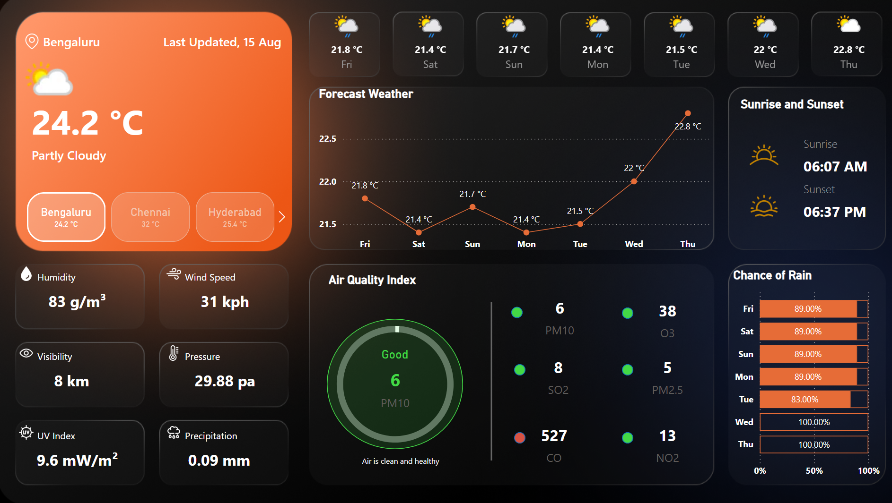

# 🌤 Real-Time Weather & Air Quality Dashboard (Power BI)



## 📌 Overview

This **Power BI dashboard** provides **real-time weather** and **air quality** information for multiple cities.  
It uses the [WeatherAPI](https://www.weatherapi.com/) to fetch live data and visualize it in an interactive format.  
The design features a modern dark theme with clear, color-coded visualizations.

---

## ✨ Features

- **Current Weather Conditions**: Displays temperature, weather description, and location.
- **Multi-City Switching**: View weather for Bengaluru, Chennai, Hyderabad, and more.
- **7-Day Forecast**: Line chart showing daily temperature trends.
- **Sunrise & Sunset Times**: Automatically updates based on the selected location.
- **Air Quality Index (AQI)**: PM10, SO2, CO, O3, PM2.5, and NO2 levels with health indicators.
- **Humidity, Wind Speed, Visibility, Pressure, UV Index, Precipitation**: Key weather metrics in real time.
- **Chance of Rain**: Bar chart showing rain probability for the next 7 days.

---

## 🛠 Data Source

This dashboard uses the **WeatherAPI** endpoint:
> **Note:** The `.pbix` file provided contains a **placeholder API key**. You must replace it with your own key to get live data.

---

## 🚀 Setup Instructions

1. **Get a free API key** from [WeatherAPI](https://www.weatherapi.com/).
2. **Download this repository**:

   ```bash
   git clone https://github.com/aswnvm/Real-Time-Weather-Dashboard.git
    ```

3. Open dashboard.pbix in Power BI Desktop.
4. Go to:

```bash
    Transform Data → Manage Parameters
```

5. Replace YOUR_API_KEY_HERE with your actual API key.
6. Click Close & Apply and then Refresh.

[Weather_Dashboard](https://app.powerbi.com/view?r=eyJrIjoiOGM5ZjExYmItYzlmMy00YjhkLWJmN2UtZTk4YzYxY2IzYzQ2IiwidCI6IjBmZGYwYzdmLTA2OWMtNDE0YS05MTM2LWQwZjRlYmIzMDliOSJ9)
